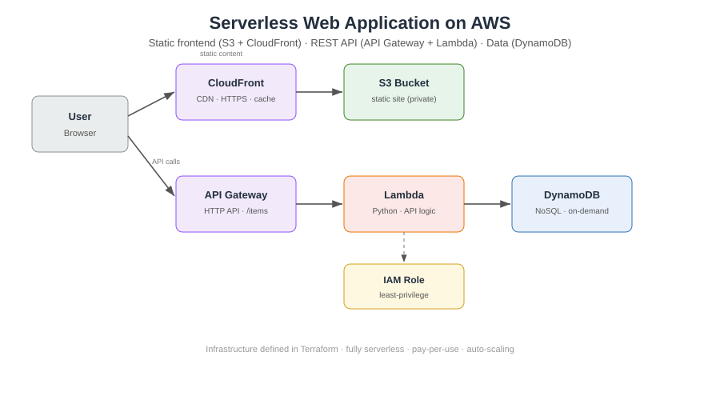

# Serverless Web Application on AWS (Architecture + Terraform)

A reference architecture and Infrastructure-as-Code (Terraform) implementation of
a **fully serverless web application** on AWS — a static frontend delivered
globally via CloudFront, a REST API on API Gateway backed by AWS Lambda, and data
stored in DynamoDB. No servers to manage, automatic scaling, and pay-per-use.

> **Note on scope:** This repository is an **architecture + IaC design artefact**.
> The Terraform is written to be correct and deployable, and is validated with
> static analysis (Checkov), but it is **not deployed to a live, billed AWS
> account**. It demonstrates cloud architecture and infrastructure-as-code skills.

---

## Architecture



**Request flows:**
- **Static content:** User → CloudFront (CDN, HTTPS, caching) → S3 (private bucket).
  The S3 bucket is locked down; only CloudFront can read it (Origin Access Control).
- **API calls:** User → API Gateway (HTTP API) → Lambda (Python) → DynamoDB.

## AWS services used and why

| Service | Role | Why this choice |
|---|---|---|
| **Amazon S3** | Hosts the static frontend | Cheap, durable object storage; kept private |
| **Amazon CloudFront** | CDN in front of S3 | Global low-latency delivery, HTTPS, caching |
| **Amazon API Gateway** | Public REST endpoint | Managed, scalable HTTP entry point to Lambda |
| **AWS Lambda** | API business logic | Serverless compute; no servers, scales to zero |
| **Amazon DynamoDB** | Data store | Serverless NoSQL, on-demand billing, single-digit-ms latency |
| **AWS IAM** | Permissions | Least-privilege role: Lambda can touch only its table |

## Well-Architected design choices

- **Security:** S3 fully private with public access blocked; CloudFront-only read via
  Origin Access Control; HTTPS enforced (`redirect-to-https`); encryption at rest on
  S3 and DynamoDB; least-privilege IAM scoped to the single table.
- **Reliability:** DynamoDB point-in-time recovery; S3 versioning.
- **Cost optimisation:** Everything is pay-per-use — DynamoDB on-demand, Lambda
  per-invocation, no idle servers.
- **Operational excellence:** All infrastructure defined as code (Terraform);
  Lambda logs to CloudWatch.

## Validation

The Terraform was scanned with **Checkov** (static IaC security analysis):
**44 checks passed**, covering the core security fundamentals (encryption,
public-access blocking, least-privilege IAM, HTTPS, point-in-time recovery). The
remaining findings are enterprise-grade hardening extras (WAF, KMS CMKs, access
logging, cross-region replication) intentionally out of scope for this demo and
noted as a production roadmap below.

## Repository structure

```
aws1-serverless-webapp/
├── README.md
├── terraform/
│   ├── main.tf          # all resources (S3, CloudFront, API GW, Lambda, DynamoDB, IAM)
│   ├── variables.tf     # configurable inputs
│   └── outputs.tf       # API endpoint, CloudFront domain, table name
├── src/
│   └── handler.py       # Lambda function (Python) — GET/POST /items
└── diagrams/
    └── architecture.svg
```

## How it would deploy (reference)

```bash
cd terraform
terraform init      # download the AWS provider
terraform plan      # preview the resources
terraform apply     # create them (in a real AWS account)
```

## Production roadmap (what I'd add for a real deployment)

- AWS WAF on CloudFront; a response-headers (security headers) policy
- KMS customer-managed keys for S3/DynamoDB encryption
- S3 access logging + lifecycle rules; CloudFront access logs
- A custom domain + ACM certificate
- CI/CD pipeline (e.g. GitHub Actions) running `terraform plan` on PRs

## Skills demonstrated

AWS solution architecture · serverless design · Terraform (Infrastructure as
Code) · IAM least-privilege · API Gateway + Lambda + DynamoDB · CloudFront/S3
static hosting · AWS Well-Architected principles · IaC security scanning (Checkov).
